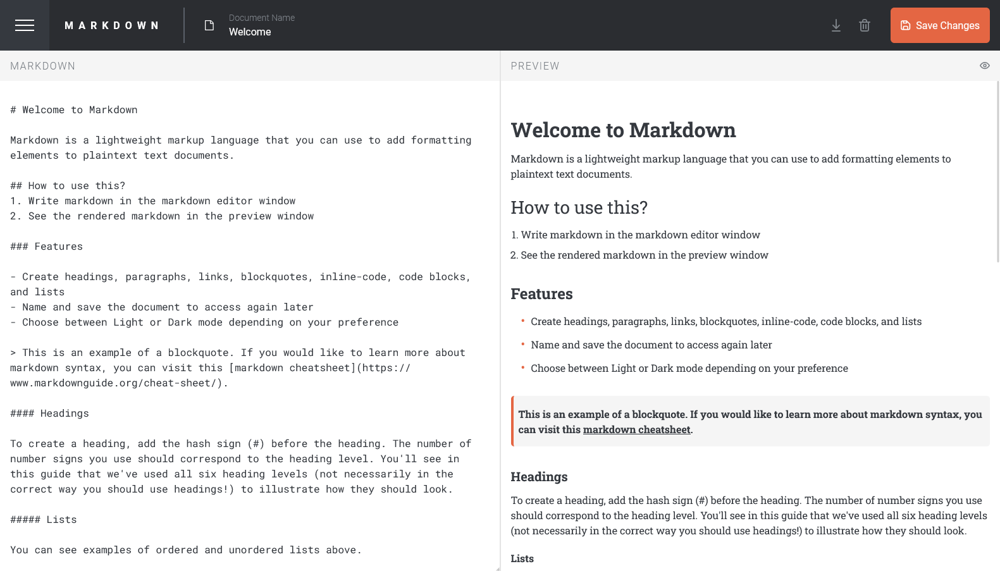

# In-browser markdown editor - Solution 📝

This is a solution to the in-browser-Markdown-Editor.

It is a full ###Frontend Project



## Table of contents 📚

- [Overview](#overview)
    - [The challenge](#the-challenge)
    - [Screenshot](#screenshot)
    - [Links](#links)
- [My process](#my-process)
    - [Built with](#built-with)
    - [What I learned](#what-i-learned)
    - [Continued development](#continued-development)
    - [Code Showcase](#code-showcase)
    - [Useful resources](#useful-resources)
- [Author](#author)

## Overview 👀

### The challenge

Users should be able to:

- Create, Read, Update, and Delete markdown documents
- Name and save documents to be accessed as needed
- Edit the markdown of a document and see the formatted preview of the content
- View a full-page preview of the formatted content
- View the optimal layout for the app depending on their device's screen size
- See hover states for all interactive elements on the page
- **Bonus**: If you're building a purely front-end project, use localStorage to save the current state in the browser that persists when the browser is refreshed
- **Bonus**: Build this project as a full-stack application

### Screenshot 📸

.png)

### Links 🔗

- Solution URL: [Github Repository](https://github.com/QuayeDNA/Markdown_Editor)
- Live Site URL: [Deployed Live](https://markdown-editor-vite.vercel.app/)

## My process 🚀

### Built with

- HTML, CSS, Javascript
- Tailwindcss
- Redux
- [React](https://reactjs.org/) - TS library
- [Vite](https://vitejs.dev/) - React Framework
- [React Markdown](https://github.com/remarkjs/react-markdown) - Markdown

### What I learned 🧠

During the development of this project, I learned several important concepts and technologies:

- **Tailwind CSS**: I learned how to use Tailwind CSS to quickly build and style my React components. I also learned how to create custom classes in Tailwind, which allowed me to apply a group of styles in one go, making my code cleaner and easier to read.

- **Redux**: I learned how to use Redux for state management in my React application. This included creating actions and reducers, connecting components to the Redux store, and dispatching actions to update the state.

- **React Markdown**: I learned how to use the `react-markdown` library to render markdown content in my React components. This was particularly useful for the preview feature of the markdown editor.

- **Vite**: I learned how to use Vite as a build tool for my React application. Vite improved my development experience with features like fast hot module replacement and optimized production builds.

### Code Showcase 💻

Here are some code snippets from this project that I'm particularly proud of.

#### Redux Reducers

Here's an example of a reducer I wrote for this project:

```typescript

const initialState: SidebarState = {
    isOpen: false,
};

export const sidebarSlice = createSlice({
    name: 'sidebar',
    initialState,
    reducers: {
        toggleSidebar: (state) => {
            state.isOpen = !state.isOpen;
        },
    },
});

export const { toggleSidebar } = sidebarSlice.actions;

export default sidebarSlice.reducer;
```

This reducer handles actions of type 'TOGGLE SIDEBAR' and updates the state accordingly. I'm proud of this code because it's a clear example of how Redux can be used to manage state in a React application.

### Continued development 🚧

I plan to continue developing my skills in these areas and apply what I've learned to future projects.

### Useful resources 📖

- [🔍 Stack Overflow](https://stackoverflow.com) - A great resource for finding answers to specific programming questions. I've found it incredibly helpful for debugging issues.
- [💻 CodeSandbox](https://codesandbox.io) - An online code editor that I used for quickly prototyping ideas and sharing code with others.
- [🎥 YouTube](https://www.youtube.com) - There are many great programming tutorials and lectures here that can help you understand complex concepts.
- [👥 GitHub](https://github.com) - A platform for version control and collaboration. It lets you and others work together on projects from anywhere.

## Author 👤

**👤 QUAYE DAVID NII AYITEY**

- [🔗 Profile](https://github.com/QuayeDNA/) - GitHub profile
- [📧 Email](mailto:quayedavid245@gmail.com) - Email address

Feel free to contact me with any questions! 📬
